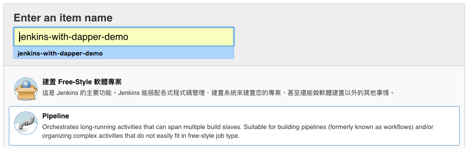
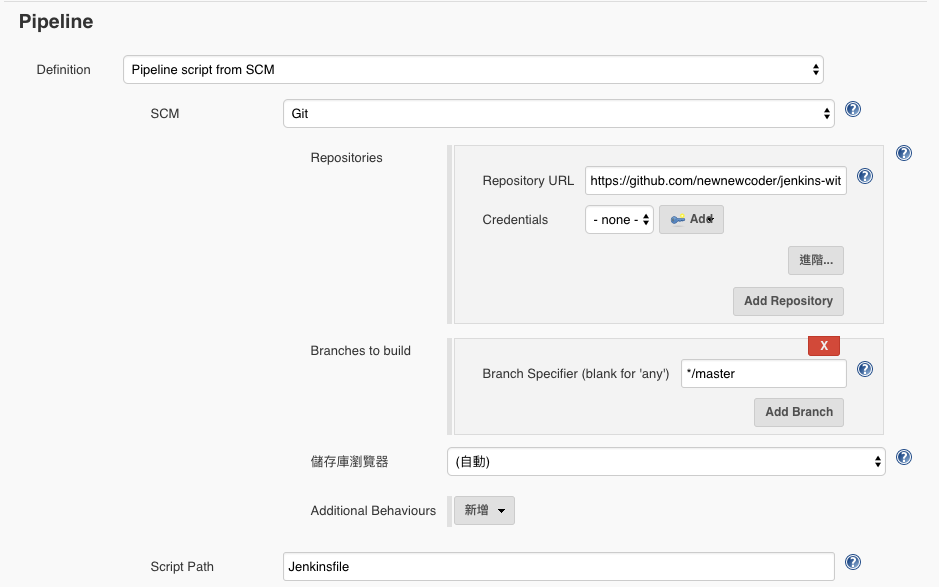
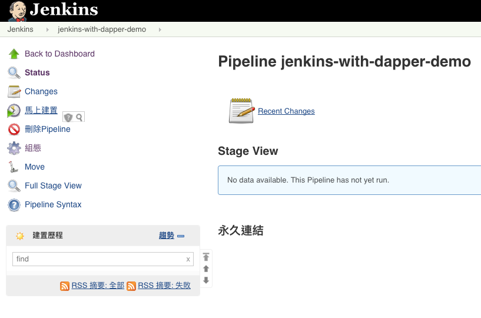
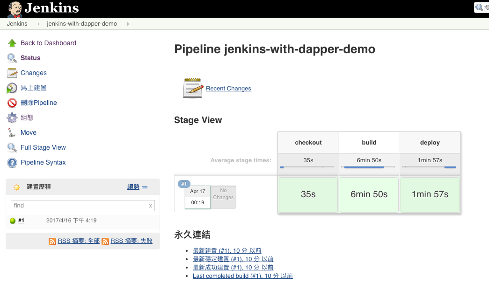
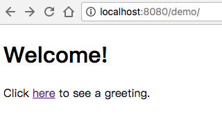

# This is a simple Jenkins CI flow demo

## Introduction
This demo is based on [spring-guides/gs-securing-web](https://github.com/spring-guides/gs-securing-web). I add selenium tests for web login, change some code for packaging a war, and add [Dockerfile.dapper](https://github.com/newnewcoder/jenkins-with-dapper-demo/blob/master/Dockerfile.dapper), which uses gradle to build this poject in docker container. 

I also add a [Jenkinsfile](https://github.com/newnewcoder/jenkins-with-dapper-demo/blob/master/Jenkinsfile) to run a pipeline job including checking out the project from github, starting a docker container, using gradle to compile java code, running unit and selenium tests, packaging a war file and then deploying war to JBoss web application server.

## Prerequisite
### Compulsory
Docker - get from [here](https://store.docker.com/search?type=edition&offering=community).
### Optional
1. Java - get from [OpenJDK8](http://openjdk.java.net/install/) or [OracleJDK8](http://www.oracle.com/technetwork/java/javase/downloads/index-jsp-138363.html).
2. Dapper - get from [here](https://github.com/rancher/dapper).

## How to run this demo
### Step 1.

Fork this project, and clone repository you forked to local.

### Step 2.

Find `docker-compose.yml`, and edit it.

~~~yml
version: '2'
services:
  jboss:
    image: newnewcoder/jboss-wildfly
    container_name: jboss
    ports:
      - "8080:8080"
      - "9990:9990"
  jenkins:
    image: newnewcoder/jenkins-dood-dapper
    container_name: jenkins
    volumes:
      - /var/run/docker.sock:/var/run/docker.sock
      # change "/Users/Pinky/jenkins/home" to your own
      - /Users/Pinky/jenkins/home:/var/jenkins_home
    ports:
      - "8081:8080"
~~~

Change `/Users/Pinky/jenkins/home` to your own jenkins_home location.

### Step 3.

Start up Jenkins server and JBoss AP Server.

~~~sh
docker-compose up -d
~~~

Now you can access JBoss Admin UI at [http://localhost:9990](http://localhost:9990) (default account/password is admin/admin), and Jenkins at [http://localhost:8081](http://localhost:8081)

### Step 4.

Setting up your own Jenkins server.

You can refer to [this](https://devopscube.com/install-configure-jenkins-2-0/).

### Step 5.

Create a pipeline job.

Setting pipeline script from SCM

Save it.

### Step 6. 

Run this job.

When job done, you can see below:

And also you can see the web deployed to the JBoss at [http://localhost:8080/demo](http://localhost:8080/demo):

### Step 7.

Demo is done!!